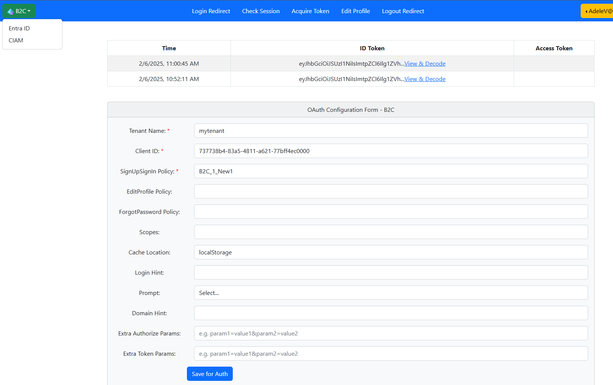

# Azuer B2C OAuth / OIDC Configuration & Testing

This app provides the ability to configure Azure B2C OAuth / OIDC authentication parameters and test the authentication flow.

1. Configurable OAuth / OIDC authentication parameters, e.g. Client ID, Scope permission etc.
2. Quick & easy testing of Entra OAuth authentication.
3. MSAL (Microsoft Authentication Library) function test.

Microsoft Azure Active Directory B2C provides business-to-customer identity as a service. Your customers can use their preferred social, enterprise, or local account identities to get single sign-on access to your applications and APIs.  
https://learn.microsoft.com/en-us/azure/active-directory-b2c/overview

## Getting Started

   ```bash
   cd AzureB2C/SPA
   npm install
   npm run start-ce
   ```

*Note: By default App run at http://localhost:3003. Apps URL should be configured in authConfig.js to support menu navigation through three apps.*

In Azure portal, setup an App Registration with SPA platform, and add the redirect URI: http://localhost:3003/.  
https://learn.microsoft.com/en-us/azure/active-directory-b2c/tutorial-register-spa




