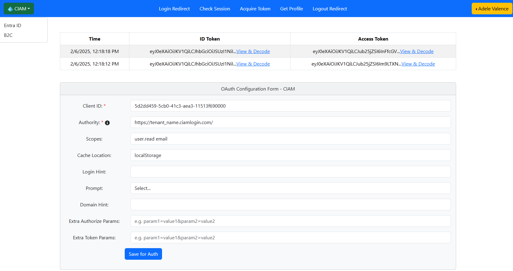

# Entra CIAM (External ID) OAuth / OIDC Configuration & Testing

This app provides the ability to configure Entra CIAM (External ID) OAuth / OIDC authentication parameters and test the authentication flow.

1. Configurable OAuth / OIDC authentication parameters, e.g. Client ID, Scope permission etc.
2. Quick & easy testing of Entra OAuth authentication.
3. MSAL (Microsoft Authentication Library) function text.

Microsoft Entra External ID includes Microsoft's customer identity and access management (CIAM) solution. For organizations and businesses that want to make their apps available to consumers and business customers, External ID makes it easy to add CIAM features like self-service registration, personalized sign-in experiences, and customer account management. Because these CIAM capabilities are built into Microsoft Entra ID, you also benefit from platform features like enhanced security, compliance, and scalability.  
https://learn.microsoft.com/en-us/entra/external-id/customers/overview-customers-ciam

## Getting Started

   ```bash
   cd CIAM/SPA
   npm install
   npm run start-ce
   ```

1. By default App run at http://localhost:3002
2. Apps URL should be configured in authConfig.js to support menu navigation through three apps.




