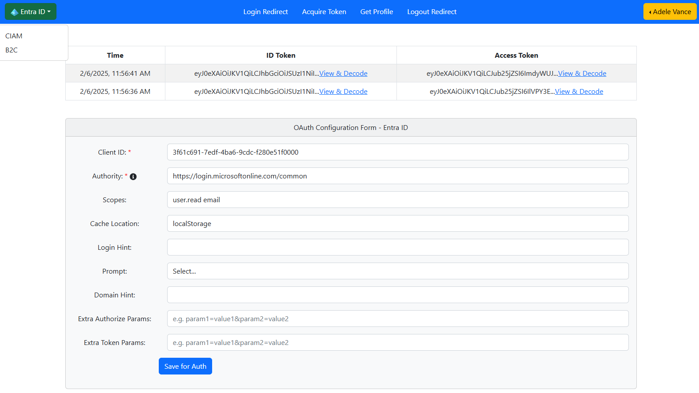

# Entra OAuth Configuration & Testing

This app provides the ability to configure Entra OAuth 2.0 authentication parameters and test the authentication flow.

1. Configurable OAuth 2.0 authentication parameters, e.g. Client ID, Scope permission etc.
2. Support for Entra ID / CIAM / Azure B2C  
3. Quick & easy testing of Entra OAuth authentication  


## Getting Started

Procedure to start one or all three SPA apps, for Entra ID, CIAM (External ID), Azure B2C.
   ```bash
   cd EntraID/SPA
   npm install
   npm run start-ce

   cd CIAM/SPA 
   npm install
   npm run start-ce

   cd AzureB2C/SPA 
   npm install
   npm run start-ce
   ```

1. By default Apps run at http://localhost:3001, http://localhost:3002, http://localhost:3003
2. Apps URL should be configured in authConfig.js to support menu navigation through three apps.


